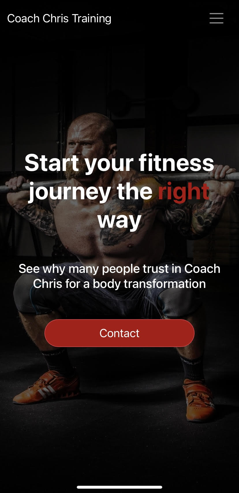
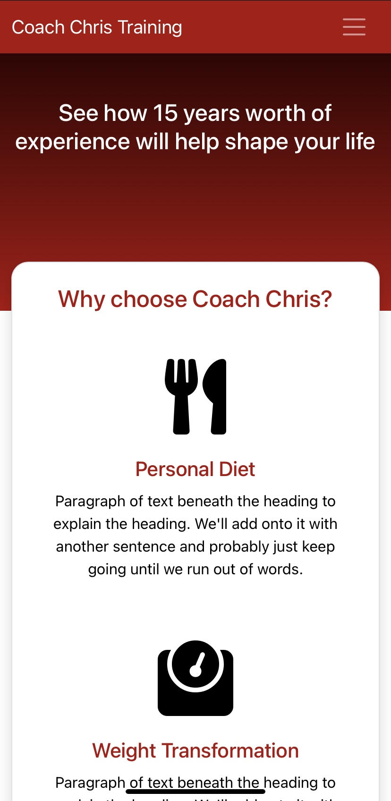
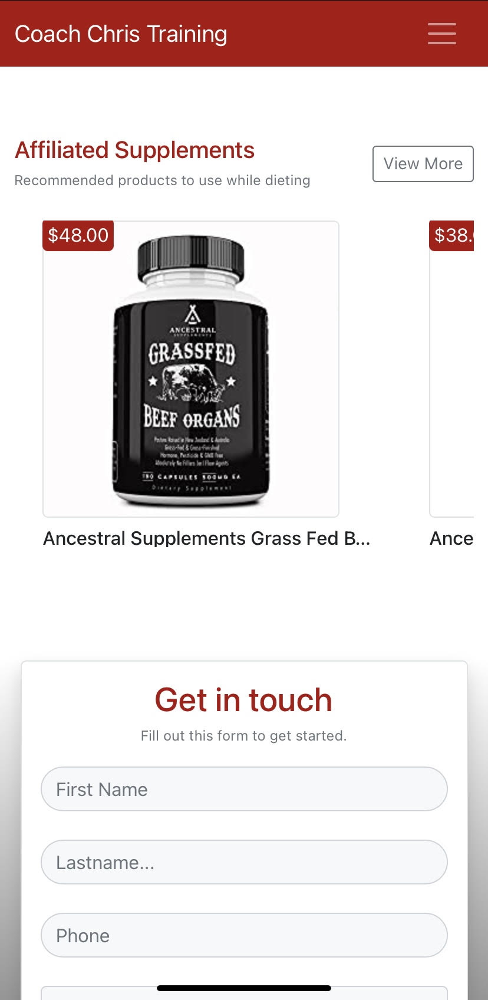
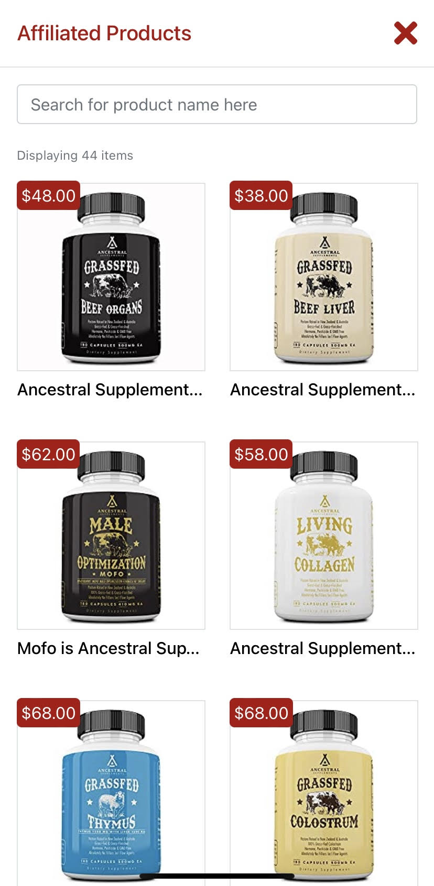

## Fitness app - Cisco Ducasse

[Link to visit app here.](https://cc-fitness.herokuapp.com)

#### Tech Stack

- React
- MySQL / Knex.js
- Node.js / Express.js
- Passport.js / Sessions
- Bootstrap / Reactstrap
- Puppeteer

I have a friend who is huge into fitness and helping others achieve their fitness goals. The only problem is that he absolutely hates using technology and doesn't care to learn for it. He was running his business strictly through text and he was having a hard time keeping track of his clients. I offered to make him a website where people can sign up for classes, buy his Amazon products, and a dashboard where he can keep track of payments and other data he might need to.

One the landing page, he wanted a easy way where people can search through his Amazon products and directly buy from it. He sent me a huge list (through text, of course) & I had to figure out a way to correctly display and link all the products. I decided to try Puppeteer and scrape all the data from Amazon. It was surpirsingly easy and fun to work around and retrieve all the products need. I later saved the data into a DB and now I can keep track of what items get sold the most, what his profit & revenue on products are and other information.

I used sessions to authenticate him and only him to his dashboard. From there, he can see all of his clients, what their workouts are through the week, any payments that are due, and scheduled appointments from authed clients. All of this data is being served by an Express.js server and data is being fetched from a MySQL database.

#### Images

#### Todos

- Finalize Dashboard design/ routes
- Create a 2FA system so people can securely schedule appointments
- Create a socket.io chat where he can use a Google number to comminucate directly through the app instead of text
